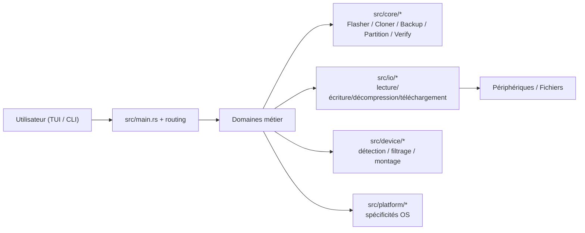

# Documentation technique — RustFlash

Ce document décrit l’architecture fonctionnelle et opérationnelle de RustFlash afin de faciliter la maintenance, l’onboarding et les futures évolutions.

## 1. Vue d’ensemble

RustFlash expose deux points d’entrée :

- **TUI** (`rustflash`) : mode interactif terminal.
- **CLI** (`rustflash <commande>`) : mode scriptable.

Les deux modes partagent les mêmes services métier pour garder un comportement cohérent (par exemple options de sécurité, vérification et gestion d’erreur).

## 2. Architecture applicative



### couches

- `src/cli` : parsing des entrées, validation initiale, lancement des flux métier.
- `src/tui` : état applicatif terminal + écrans dédiés (home / flash / clone / backup / partition).
- `src/core` : règles métier et orchestration des opérations de bas niveau.
- `src/io` : transferts blocs, décompression et téléversements éventuels.
- `src/device` : inventaire/filtrage de périphériques.
- `src/platform` : adaptation Linux / macOS / Windows.
- `src/config` : paramètres utilisateur persistants.

## 3. Flux métier principaux

### 3.1 Flash

1. L’utilisateur sélectionne une image et une cible.
2. Normalisation et validation des chemins.
3. Décompression éventuelle si format compressé.
4. Déploiement bloc à bloc avec suivi de progression.
5. Vérification d’intégrité si demandée.

### 3.2 Clone

1. Sélection source + destination.
2. Vérifications incompatibilités (taille, état, type).
3. Copie bloc par bloc (ou via option de compression).
4. Vérification et rapport final.

### 3.3 Backup / Restore

- **Backup** : création `.rfb` compactée avec métadonnées.
- **Restore** : vérification d’archive puis réapplication vers une cible.
- Intégrité assurée par checksums.

### 3.4 Gestion de partitions

1. Lecture GPT/MBR.
2. Opérations ciblées (`show`, `create`, `add`, `delete`, `format`, effacement).
3. Édition sécurisée et feedback explicite de confirmation.

## 4. Modèles de sécurité

- Les opérations critiques demandent confirmations explicites côté UX.
- Les périphériques cibles sont résolus avant exécution.
- Les écritures sont conçues pour rester explicites et traçables.
- L’intégrité (hash et checksums) est intégrée en première intention sur les parcours de flash / backup.

## 5. Configuration

Les paramètres applicatifs sont placés dans `src/config` et influencent notamment :

- thèmes TUI,
- préférences de vérification,
- répertoire de travail par défaut,
- options d’interface.

## 6. Référence CLI exacte (issue du code `src/cli/*`)

### 6.1 Options globales

Exécuter :

```bash
rustflash --help
```

- `--tui` : lance le TUI (mode par défaut si aucune sous-commande n’est fournie)
- `-v, --verbose...` : augmente la verbosité (`-v`, `-vv`, `-vvv`)
- `--config <CONFIG>` : chemin du fichier de configuration
- `-h, --help` : aide
- `-V, --version` : version

### 6.2 Commandes disponibles

- `flash` : `flash --help`
- `clone` : `clone --help`
- `backup` : `backup --help`
- `restore` : `restore --help`
- `partition` : `partition --help`
- `list` : `list --help`

### 6.3 Signatures exactes par commande

#### `flash`

- `-i, --image <IMAGE>` : chemin local ou URL de l’image (obligatoire)
- `-t, --target <TARGET>...` : cible(s), répétable pour flash parallèle
- `--verify` : vérification après écriture
- `--block-size <BLOCK_SIZE>` : taille de bloc en octets (défaut `4194304`, soit 4 Mio)
- `--yes` : ignore l’avertissement de confirmation
- `--checksum <CHECKSUM>` : empreinte attendue (`sha256:HASH`, `sha512:HASH`, `md5:HASH`)

#### `clone`

- `-s, --source <SOURCE>` : source (bloc)
- `-d, --dest <DEST>` : destination (bloc ou fichier)
- `--smart` : clone intelligent (seuls secteurs utilisés)
- `--compress <COMPRESS>` : `gzip`, `xz` ou `zstd` (quand destination fichier)
- `--verify` : vérification après clonage
- `--yes` : ignore l’avertissement

#### `backup`

- `-s, --source <SOURCE>` : source du backup
- `-o, --output <OUTPUT>` : sortie `.rfb`
- `--compress <COMPRESS>` : `zstd` (défaut), `gzip`, `xz`
- `--level <LEVEL>` : niveau de compression (optionnel)
- `--smart` : backup secteurs utilisés uniquement
- `--yes` : ignore l’avertissement

#### `restore`

- `-i, --input <INPUT>` : fichier `.rfb`
- `-t, --target <TARGET>` : périphérique cible
- `--verify` : vérification après restauration
- `--dry-run` : vérification de compatibilité sans écriture
- `--yes` : ignore l’avertissement

#### `list`

- `--json` : sortie JSON
- `--all` : inclut les disques système

#### `partition`

- Syntaxe : `rustflash partition <DEVICE> <ACTION>`
- `create <TABLE_TYPE>` : `gpt` ou `mbr`
- `add --fs-type <FS_TYPE> --size <SIZE> [--label <LABEL>] [--flag <FLAG>]`
  - `--fs-type` : `ext4`, `fat32`, `ntfs`, `exfat`, `swap`
  - `--size` : `256M`, `4G`, `remaining`
  - `--label`, `--flag` : optionnels
- `delete --number <NUMBER>`
- `format --number <NUMBER> --fs-type <FS_TYPE> [--label <LABEL>]`
- `show`
- `erase [--method <METHOD>]` : `zero` (défaut), `random`, `dod`

### 6.4 Exemple d’appels conformes

```bash
rustflash flash -i ubuntu.iso -t /dev/sdb -t /dev/sdc --block-size 4194304 --yes
rustflash clone -s /dev/sda -d /dev/sdb --smart --verify
rustflash backup -s /dev/sdc -o backup.rfb --compress zstd --level 3 --yes
rustflash restore -i backup.rfb -t /dev/sdc --dry-run --yes
rustflash list --all --json
rustflash partition /dev/sdb add -t ext4 -s 4G -l data
rustflash partition /dev/sdb erase --method random
```

## 7. Compatibilité

- **Plateformes cibles** : Linux, Windows, macOS
- **Formats images** : `.img`, `.iso`, `.raw`
- **Formats compressés** : `.gz`, `.xz`, `.zst`, `.bz2`, `.zip`
- **Backups** : `.rfb`

## 8. Vérification de cohérence doc/CLI

Pour maintenir la synchronisation exacte :

- documenter depuis le code source dans `src/cli`
- valider les options via `cargo run -- <cmd> --help` après chaque ajout de drapeau

## 9. Génération de la documentation Rust (module natif)

La documentation complète, y compris modules, fonctions, structs, enums et méthodes, est générée par `rustdoc` avec la commande :

```bash
cargo doc --no-deps --document-private-items
```

Résultat :
- HTML : `target/doc/rustflash/index.html`
- Vérification rapide : exécution terminée en succès avec le jeu actuel sans erreur.

Commandes utiles en routine :

```bash
cargo doc --no-deps --document-private-items
cargo doc --no-deps --document-private-items --open
```

## 10. Tests et assurance qualité

- **Unitaires/intégration** : `cargo test`
- **Lint** : `cargo fmt --check`, `cargo clippy`
- **Benchmarks** : `cargo bench`

Les scénarios critiques à maintenir :

- opération sur média correct/incorrect,
- annulation d’opération en cours,
- vérification de checksum,
- erreurs d’E/S et gestion des droits.

## 11. Références rapides

- `README.md` : vue produit, installation, usage
- `NOTICE.md` : attributions et licences
- `Cargo.toml` : dépendances et cible packaging
- `Cargo.lock` : versions exactes des dépendances
